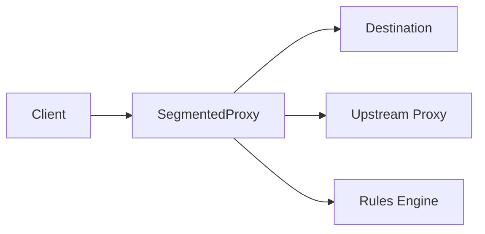

# Architecture

## Overview
This document explains the high-level architecture of SegmentedProxy.
It shows the main parts and how data moves through them.
Use it as a conceptual map before reading detailed topics.
It sits between the quick guides and the deeper behavior notes.

## High-Level Components
### Client
The client is your browser or app.
It sends requests and receives responses.
It does not change how it speaks HTTP or HTTPS.

### SegmentedProxy
SegmentedProxy sits between the client and the destination.
It accepts requests, applies rules, and forwards data.
It can change timing and chunk size, but not content.

### Rules engine
The rules engine decides what to do with each request.
It can allow, block, or forward through an upstream.
It can also turn segmentation on or off for a match.

### Upstream server or direct connection
The proxy can connect directly to the destination.
It can also forward through another upstream proxy.
This choice is part of the rule decision.

### DNS resolution
When a hostname is used, a DNS lookup may happen.
This is a small but important step in the flow.

## Data Flow Overview
The common path is Client → SegmentedProxy → Destination.
The proxy may buffer data in small chunks before sending it on.
Segmentation is applied during forwarding, after rules match.
The focus is on timing and chunking, not on content changes.

## HTTP vs HTTPS Flow
### HTTP
For HTTP, requests and responses are visible to the proxy.
This helps the rules engine match on method, host, or path.
Segmentation, if enabled, applies to the forwarded HTTP data.

### HTTPS
For HTTPS, the proxy only sees the CONNECT tunnel request.
TLS is never decrypted by the proxy.
After CONNECT, the proxy forwards encrypted bytes.
Segmentation can still apply, but only to the encrypted stream.

## Where Segmentation Lives
Segmentation happens after rule matching.
It happens while forwarding data, not before rules are chosen.
It is independent from application-level meaning.
It only changes timing and grouping of bytes.

## What the Proxy Never Sees
The proxy does not see TLS content.
It does not see application semantics inside HTTPS.
It does not see user credentials inside HTTPS.

## Design Goals (Educational)
Teach flow control concepts in a simple way.
Allow safe, small experiments for learning.
Avoid invasive inspection of user traffic.

## Non-Goals
This is not a production-hardened system.
It is not a DPI bypass.
It is not a traffic hiding tool.
It is not a MITM proxy.

## Simple Flow Diagram

