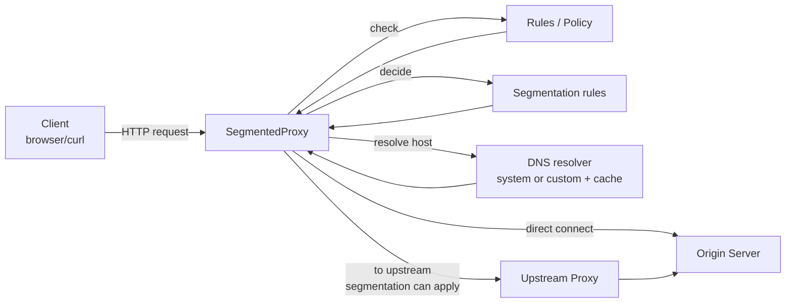

# Architecture Overview

This page gives a simple view of how SegmentedProxy works.
It is a learning guide, not a full spec.

## HTTP and outbound paths



Notes:
- Rules/policy are checked before any outbound connection.
- Segmentation is only applied on the client -> upstream direction.
- For HTTP forward, segmentation is used only when the action is upstream.

## HTTPS CONNECT tunnel

```mermaid
sequenceDiagram
    participant Client
    participant Proxy as SegmentedProxy
    participant Upstream as Upstream Proxy
    participant Origin as Origin Server

    Client->>Proxy: CONNECT host:port
    alt direct
        Proxy->>Origin: TCP connect
    else upstream
        Proxy->>Upstream: TCP connect
        Proxy->>Upstream: CONNECT host:port
        Upstream->>Origin: TCP connect
    end
    Proxy-->>Client: 200 Connection established
    Client<->>Origin: Encrypted bytes tunneled (no decryption)
```

## Components

- CLI and settings: reads flags and builds the runtime config.
- Server loop: accepts TCP clients and starts a handler.
- Request handler: parses HTTP, routes CONNECT vs HTTP, and applies policy.
- HTTP parser: small helpers for requests and error replies.
- Policy checks: allow/deny rules for hosts and private IPs.
- Segmentation engine: matches rules and picks direct, upstream, or block.
- Tunnel relay: CONNECT data relay, optional segmentation on client -> upstream.
- DNS resolver: system or custom DNS, optional cache and UDP/TCP fallback.
- Net helpers: small socket read helpers.

## Data flow summary for HTTP

1. Client sends an HTTP request with a full URL.
2. Proxy parses the request and checks policy and segmentation rules.
3. Proxy resolves the host with DNS (cache first).
4. Proxy connects direct to the origin or to an upstream proxy.
5. Proxy forwards the request and returns the response.
6. If action is upstream, the request body can be sent in segments.

## Data flow summary for HTTPS CONNECT

1. Client sends CONNECT host:port.
2. Proxy checks policy and segmentation rules.
3. Proxy connects to the target direct or via an upstream proxy.
4. Proxy returns "200 Connection established".
5. Proxy relays encrypted bytes without TLS decryption.
6. If enabled, segmentation applies to client -> upstream only.

## DNS flow summary

- Cache hit: reuse the cached address until TTL expires.
- Cache miss: resolve using system DNS or the custom DNS server.
- Custom DNS uses UDP by default and can retry with TCP on failure or truncation.
- If transport is set to TCP, it uses TCP only.

## Logs and debug points

- Use `--access-log` to print one access line per request or CONNECT tunnel.
- Access logs include `rid=` (request_id), action, and policy mode/strategy.
- Access logs also show DNS trace fields: dns, cache, transport, fallback.
- DEBUG logs include rule decisions and DNS cache hit/miss details.
