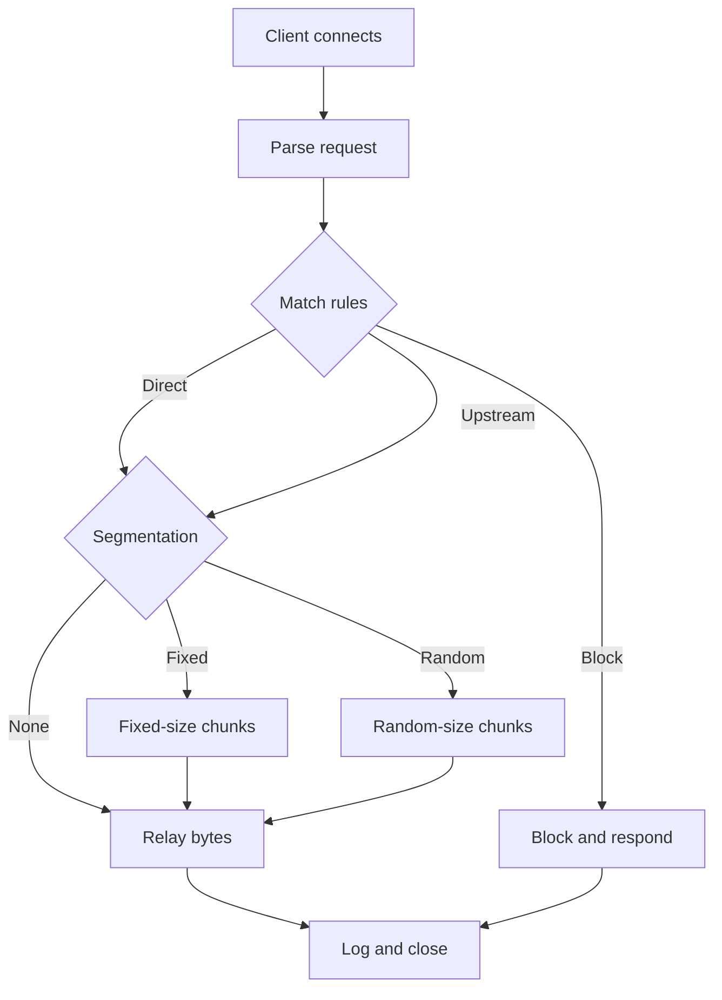

# How a Proxy Works

## The Simple Model
Browser -> Proxy -> Server

The proxy sits in the middle.
It can allow, block, or forward traffic.

Sequence diagram:


## HTTP Forward Request Flow
1. The browser sends a full URL to the proxy.
2. The proxy checks rules and policy.
3. The proxy connects to the server or an upstream proxy.
4. The proxy sends the response back to the browser.

Diagram:
```
Browser --HTTP--> Proxy --HTTP--> Server
```

## HTTPS CONNECT Tunnel Flow
1. The browser sends CONNECT host:port to the proxy.
2. The proxy checks rules and opens a TCP connection.
3. The proxy replies "200 Connection established".
4. The browser and server talk inside the tunnel.

For HTTPS CONNECT, the proxy does not decrypt TLS; it only tunnels bytes.

Diagram:
```
Browser --CONNECT--> Proxy --TCP--> Server
Browser <== TLS encrypted bytes ==> Server (through proxy)
```

## High-Level Proxy Loop


## Using an Upstream Proxy
Sometimes the proxy sends traffic to another proxy first.
That second proxy is called an upstream proxy.
Flow:
Browser -> SegmentedProxy -> Upstream proxy -> Server
This can be useful for testing rules or chaining systems.
It also helps you learn how proxies can connect to other proxies.

## References
- MDN Proxies and Tunneling: https://developer.mozilla.org/en-US/docs/Web/HTTP/Proxy_servers_and_tunneling
- RFC 7231: https://www.rfc-editor.org/rfc/rfc7231
