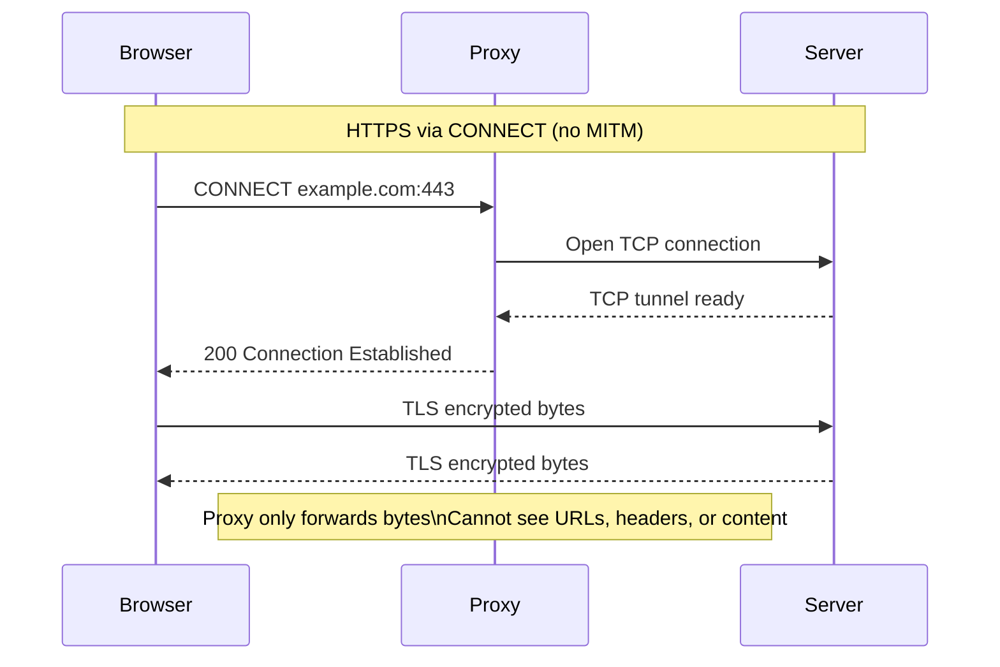
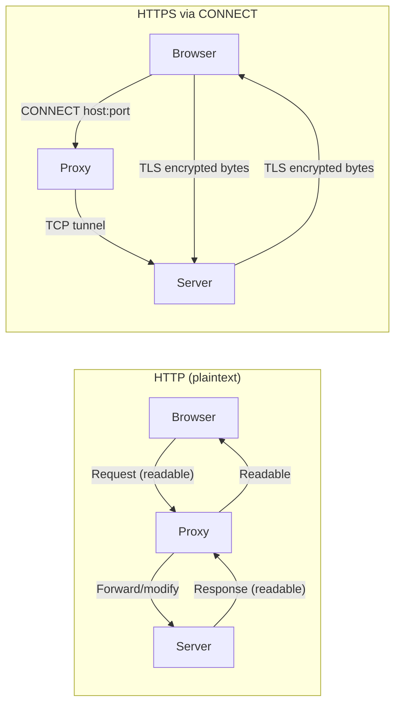

# HTTP vs HTTPS

## What is HTTP?
HTTP is a simple protocol for web requests.
It sends data as plain text.
Anyone on the path can read it.

## What is HTTPS?
HTTPS is HTTP with encryption.
The browser and the server create a secure TLS connection.
Other devices only see encrypted bytes.

## Why HTTPS Uses CONNECT in Proxies
A proxy cannot read encrypted data.
So the browser asks the proxy to open a tunnel.
This uses the CONNECT method.

## Why Proxies Cannot See Encrypted Content
After CONNECT, the TLS handshake is inside the tunnel.
The proxy only forwards bytes.
It cannot see the page or passwords.

## Diagram: HTTPS CONNECT tunnel (what happens)

## Diagram: HTTP vs HTTPS at a Proxy

## HTTPS Observation Limits
What the proxy can observe:
- CONNECT target host:port
- Connection timing and byte counts

What it cannot observe:
- URLs, headers, and bodies inside TLS
- Response content or status codes

## Common Misconceptions
- CONNECT is not MITM.
- CONNECT does not expose HTTPS content.
- Certificate warnings usually happen only with MITM proxies.

## More Reading
- MDN HTTP Overview: https://developer.mozilla.org/en-US/docs/Web/HTTP/Overview
- MDN CONNECT method: https://developer.mozilla.org/en-US/docs/Web/HTTP/Methods/CONNECT
- Cloudflare HTTP vs HTTPS: https://www.cloudflare.com/learning/ssl/what-is-https/
