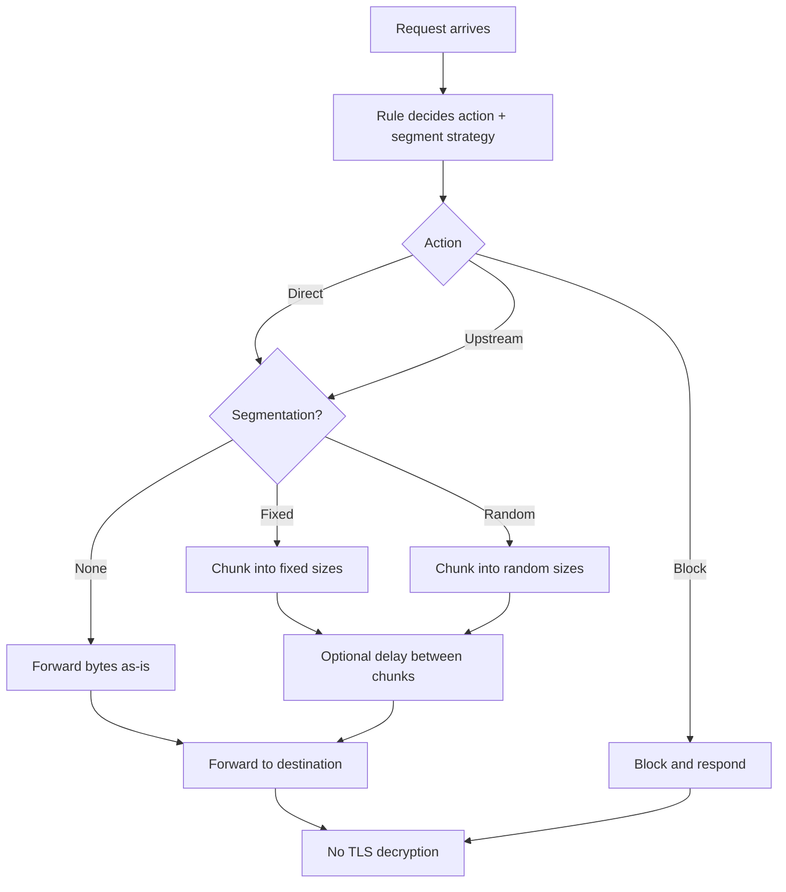
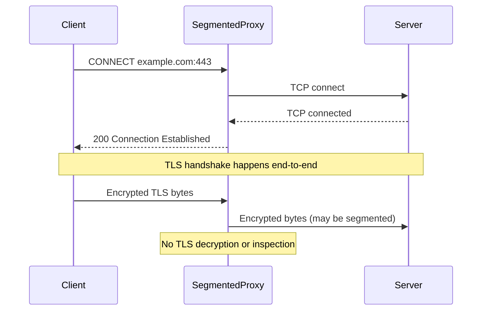

# Segmentation

## Overview
Segmentation in this project means splitting data into smaller chunks and optionally
spacing them out with small delays. It is a teaching tool for understanding how
proxies can shape timing and size without changing the content.

## How SegmentedProxy Decides
The proxy evaluates rules, chooses an action or route, and then applies a
segmentation strategy if one is configured for that match.



Key takeaways:
- Rules choose both the action and the segmentation strategy.
- Segmentation changes timing and chunking, not the content.
- HTTPS stays encrypted end-to-end; the proxy does not decrypt TLS.

## HTTPS CONNECT and Where Segmentation Applies
SegmentedProxy does not decrypt TLS. For HTTPS, it only sees the CONNECT request
and then forwards encrypted bytes. Segmentation, if enabled, applies to the bytes
it forwards, not to the decrypted content.



## What segmentation is / is not
### What it teaches
Segmentation helps you observe:
- Timing and size shaping
- Chunking and buffering behavior
- How proxies can influence flow patterns

### Non-goals
It is not:
- A guaranteed DPI bypass
- A method for hiding traffic
- A man-in-the-middle (MITM) tool

## Configuration examples
These examples match the rule syntax style used in `examples/rules.txt`.

```text
# Fixed segmentation with an upstream proxy
*.example.com=segment_upstream,action=upstream,upstream=127.0.0.1:3128,strategy=fixed,chunk=512

# Random segmentation with min/max and delay (ms)
*.example.com=segment_upstream,scheme=https,method=CONNECT,strategy=random,min=256,max=1024,delay=10

# Limit segmentation to CONNECT only
*.example.com=segment_upstream,scheme=https,method=CONNECT,strategy=fixed,chunk=768

# Limit segmentation to a path prefix (HTTP)
api.example.com=segment_upstream,scheme=http,method=POST,path_prefix=/v1/upload,strategy=random,min=128,max=512,delay=5
```

## Try it yourself
### 1) Compare fixed vs random timing
- Enable fixed segmentation for a host and capture logs.
- Switch to random segmentation and compare request timing in logs.
- Note how chunk patterns change even when the content is the same.

### 2) CONNECT-only vs all HTTPS traffic
- Add a CONNECT-only rule for a test domain.
- Add a second rule without method filtering.
- Observe which flows are segmented by checking logs and timestamps.

### 3) Path prefix targeting for HTTP
- Apply segmentation only to an upload path.
- Make two HTTP requests: one to the upload path, one to a different path.
- Confirm only the upload path is segmented.

## References
- Cloudflare DPI: https://www.cloudflare.com/learning/security/glossary/deep-packet-inspection-dpi/
- Traffic analysis: https://www.cloudflare.com/learning/privacy/what-is-traffic-analysis/
